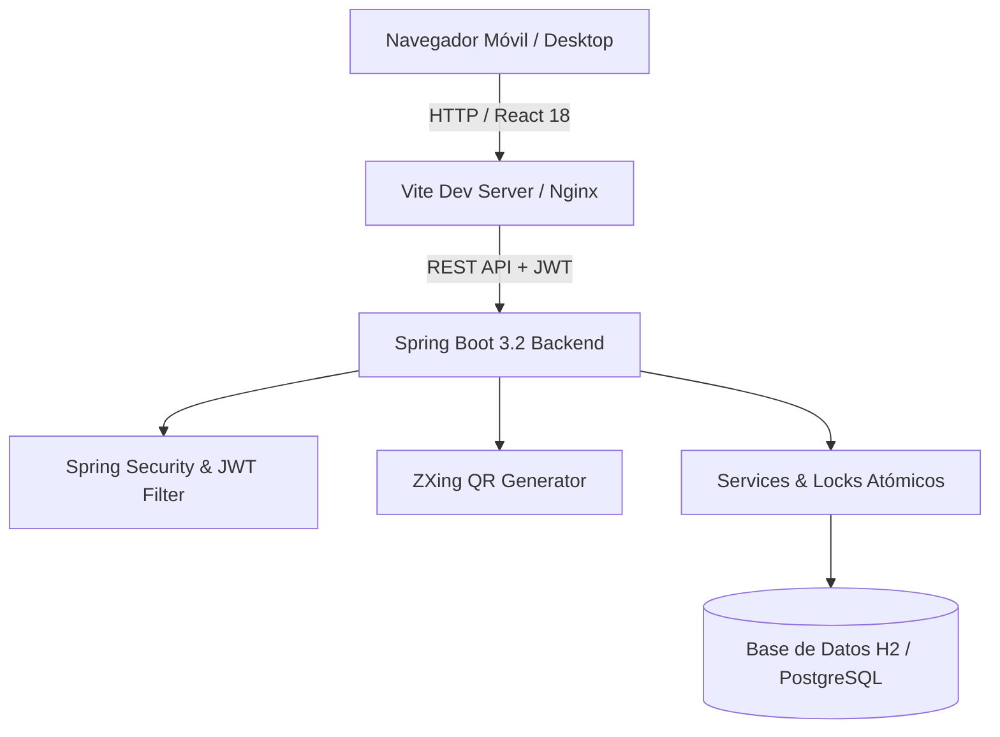

# 🍱 LunchPass — Sistema Corporativo de Reservación, Gestión y Validación QR de Almuerzos


**LunchPass** es una plataforma web enterprise integral diseñada para automatizar y auditar el ciclo de vida completo de los almuerzos corporativos en empresas e instituciones. Combina un backend robusto en Spring Boot con un frontend moderno y responsivo en React + TypeScript, ofreciendo reservación de menús por fecha, asignación de comensales, validación en tiempo real mediante escáner QR de cámara móvil y reportes ejecutivos.

---

## 📑 Tabla de Contenidos

1. [Visión General & Problema Solucionado](#-visión-general--problema-solucionado)
2. [Características Destacadas](#-características-destacadas)
3. [Matriz de Roles y Permisos](#-matriz-de-roles-y-permisos)
4. [Arquitectura del Sistema](#-arquitectura-del-sistema)
5. [Especificación de la API REST](#-especificación-de-la-api-rest)
6. [Modelo de Base de Datos](#-modelo-de-base-de-datos)
7. [Credenciales de Prueba (Demo Access)](#-credenciales-de-prueba-demo-access)
8. [Guía de Instalación y Despliegue](#-guía-de-instalación-y-despliegue)
9. [Despliegue Móvil en Red Wi-Fi](#-despliegue-móvil-en-red-wi-fi)
10. [Licencia & Contacto](#-licencia--contacto)

---

## 🎯 Visión General & Problema Solucionado

En comedores corporativos tradicionales, el control manual de pases genera filas de espera, consumo no autorizado, duplicación de ticket y desperdicio de comida. **LunchPass** resuelve esto mediante:

- 🎟️ **Tickets Digitales QR Únicos**: Cada reserva genera un ticket `LP-2026-XXXXXX` respaldado por un token criptográfico HMAC.
- 🚫 **Prevención de Reutilización (Anti-Replay Lock)**: Una vez que un ticket es escaneado por el personal de caja, se marca atómicamente como `DELIVERED` / `USED`, impidiendo segundas entregas.
- 🍱 **Planificación Flexible de Menús**: Permite crear cartas con múltiples opciones (*Plato Principal, Vegetariano, Entrada, Postre, Bebida*) y fusionar o duplicar menús a fechas futuras.
- 📱 **Acceso Multi-Dispositivo**: Funciona sin instalar apps nativas directamente desde el navegador de cualquier smartphone, tablet o laptop.

---

## ✨ Características Destacadas

### 👤 Portal del Empleado
- **Catálogo de Menús**: Filtro por fecha con información nutricional (kcal), categorías de platos y fotos descriptivas.
- **Asignación de Comensal**: Permite seleccionar a qué empleado registrado se le está asignando el almuerzo reservado.
- **Ticket QR Interactivo**: Modal emergente con código de barras QR dinámico, código alfanumérico e impresión.
- **Mis Reservas**: Historial completo con filtros por estado (*Activas, Entregadas, Canceladas*) y cancelación con 1 clic.

### 📱 Escáner QR de Comedor (Rol Comedor)
- **Cámara Integrada**: Lectura directa de códigos QR desde la pantalla del celular usando `html5-qrcode`.
- **Ingreso Manual de Respaldo**: Permite escribir el código `LP-2026-XXXXXX` en caso de pantallas agrietadas.
- **Feedback Visual Inmediato**:
  - 🔵 **VÁLIDO**: Muestra el nombre del empleado, plato reservado y botón **[ CONFIRMAR ENTREGA ]**.
  - 🟢 **ENTREGA EXITOSA**: Pantalla verde con confirmación de registro grabado en la base de datos.
  - 🔴 **QR YA UTILIZADO**: Bloqueo de seguridad si se intenta reutilizar el mismo ticket.

### 🍱 Gestión de Menús (Rol Gestor)
- **Creación de Menús por Fecha**: Agrega múltiples opciones de comida con calorías y categorías.
- **Herramienta de Duplicación**: Clona la programación del menú de hoy hacia fechas futuras en 1 solo clic.
- **Fusión Automática de Platos**: Si ya existe un menú en la fecha destino, fusiona los nuevos ítems sin sobreescribir ni lanzar errores.

### 🛡️ Panel de Administración General (Rol Admin)
- **Gestión de Personal**: Alta, baja y edición de empleados y departamentos.
- **Métricas & KPIs**: Total de reservas, porcentaje de tasa de entrega, no-shows y gráficos interactivos.
- **Reportes & CSV**: Descarga de reportes tabulares por rango de fecha para contabilidad y auditoría.
- **Logs de Auditoría**: Historial de eventos de seguridad y validaciones de QR.

---

## 🎭 Matriz de Roles y Permisos

| Módulo / Funcionalidad | Empleado (`EMPLOYEE`) | Comedor (`CAFETERIA`) | Gestor Menús (`SUPERVISOR`) | Admin General (`ADMIN`) |
| :--- | :---: | :---: | :---: | :---: |
| Ver Menús Diarios y Semanales | ✅ | ✅ | ✅ | ✅ |
| Reservar Almuerzo & Generar QR | ✅ | ❌ | ❌ | ✅ |
| Escanear y Validar Tickets QR | ❌ | ✅ | ❌ | ✅ |
| Confirmar Entrega Física de Almuerzo | ❌ | ✅ | ❌ | ✅ |
| Crear y Duplicar Menús Diarios | ❌ | ❌ | ✅ | ✅ |
| Gestionar Empleados y Áreas | ❌ | ❌ | ❌ | ✅ |
| Exportar Reportes CSV y Auditoría | ❌ | ❌ | ❌ | ✅ |

---

## 🏗️ Arquitectura del Sistema



---

## 🔌 Especificación de la API REST

### **Autenticación & Usuarios**
- `POST /api/auth/login`: Autenticación con credenciales y retorno de token JWT.
- `GET /api/users/me`: Obtiene el perfil e información del usuario autenticado.

### **Menús Diarios**
- `GET /api/menus`: Lista todos los menús registrados.
- `GET /api/menus/today`: Obtiene el menú activo para la fecha actual.
- `POST /api/menus`: Crea o fusiona platos en el menú de una fecha.
- `POST /api/menus/{id}/duplicate`: Duplica el menú especificado a una nueva fecha.

### **Reservaciones & QR**
- `GET /api/reservations`: Consulta las reservas del usuario o del sistema.
- `POST /api/reservations`: Crea una nueva reserva para un empleado (`menuItemId`, `employeeId`, `date`).
- `DELETE /api/reservations/{id}`: Cancela una reserva activa.
- `POST /api/qr/validate`: Valida la autenticidad y estado de un código QR o token.

### **Entregas & Comedor**
- `POST /api/deliveries`: Registra de forma atómica la entrega física del almuerzo (`reservationId`).
- `GET /api/cafeteria/stats`: Métricas en tiempo real de esperados vs entregados.

### **Administración & Reportes**
- `GET /api/employees`: CRUD de empleados.
- `GET /api/departments`: CRUD de departamentos.
- `GET /api/reports/consumption`: Consumo por departamento y rango de fecha.
- `GET /api/audit/logs`: Historial de registros de auditoría del sistema.

---

## 🗄️ Modelo de Base de Datos

El esquema es administrado automáticamente por **Flyway Database Migrations**:

- **`roles`**: Catálogo de roles (`ADMIN`, `CAFETERIA`, `EMPLOYEE`, `SUPERVISOR`).
- **`users`**: Cuentas de acceso con contraseña encriptada BCrypt.
- **`departments`**: Áreas corporativas (Tecnología, Operaciones, Finanzas, etc.).
- **`employees`**: Ficha del personal vinculada a usuario y departamento.
- **`menus`**: Menú por fecha (`date`, `description`).
- **`menu_items`**: Opción de comida (`name`, `category`, `calories`, `price`).
- **`reservations`**: Registro de reserva con estado (`CONFIRMED`, `DELIVERED`, `CANCELLED`).
- **`qr_codes`**: Token dinámico encriptado y estado (`ACTIVE`, `USED`, `REVOKED`).
- **`meal_deliveries`**: Marca de tiempo atómica de la entrega del almuerzo.
- **`qr_validation_logs`**: Log de auditoría de cada intento de escaneo.

---

## 🔑 Credenciales de Prueba (Demo Access)

Para probar todos los roles en el entorno de desarrollo:

| Rol | Usuario | Contraseña | Enlace Directo sugerido |
| :--- | :--- | :--- | :--- |
| 👤 **Empleado** | `john.doe` / `empleado` | `password` / `empleado123` | `/inicio` |
| 📱 **Comedor** | `chef.gordon` / `cafeteria` | `password` / `cafeteria123` | `/validar-qr` |
| 🍱 **Gestor Menús** | `gestor` / `supervisor` | `supervisor123` | `/admin/menu` |
| 🛡️ **Administrador** | `admin` | `admin123` / `adminpass` | `/admin` |

*Nota: La pantalla de inicio de sesión (`/login`) cuenta además con un menú desplegable de **Acceso Rápido Demo** para ingresar con 1 solo clic.*

---

## 💻 Guía de Instalación y Despliegue

### **Requisitos del Sistema**
- **Java**: JDK 17 o superior
- **Node.js**: v18.0.0 o superior
- **Git**: Instalado

### **1. Clonar el Repositorio**
```bash
git clone https://github.com/BAZTP/LunchPass.git
cd LunchPass
```

### **2. Despliegue del Backend (Spring Boot)**
```bash
cd backend
# En Windows:
.\maven\apache-maven-3.9.5\bin\mvn.cmd spring-boot:run

# En Linux / macOS:
./mvnw spring-boot:run
```
El servidor backend se iniciará en `http://localhost:8080/api`.

### **3. Despliegue del Frontend (React + Vite)**
```bash
cd frontend
npm install
npm run dev -- --host
```
La aplicación web se iniciará en `http://localhost:5173`.

---

## 📲 Despliegue Móvil en Red Wi-Fi

Para realizar pruebas con la cámara del celular escanando desde otro dispositivo conectado a la misma red local:

1. Inicia el frontend con el flag de red:
   ```bash
   npx vite --host
   ```
2. Revisa la dirección IP mostrada en la terminal (ejemplo: `http://192.168.100.3:5173`).
3. Abre la dirección IP en el navegador Chrome/Safari de tu smartphone.

---

## 📄 Licencia & Contacto

Este proyecto está bajo la Licencia **MIT**. Consulta el archivo `LICENSE` para más detalles.

Desarrollado para la optimización digital de servicios alimentarios corporativos. 🍱🚀
